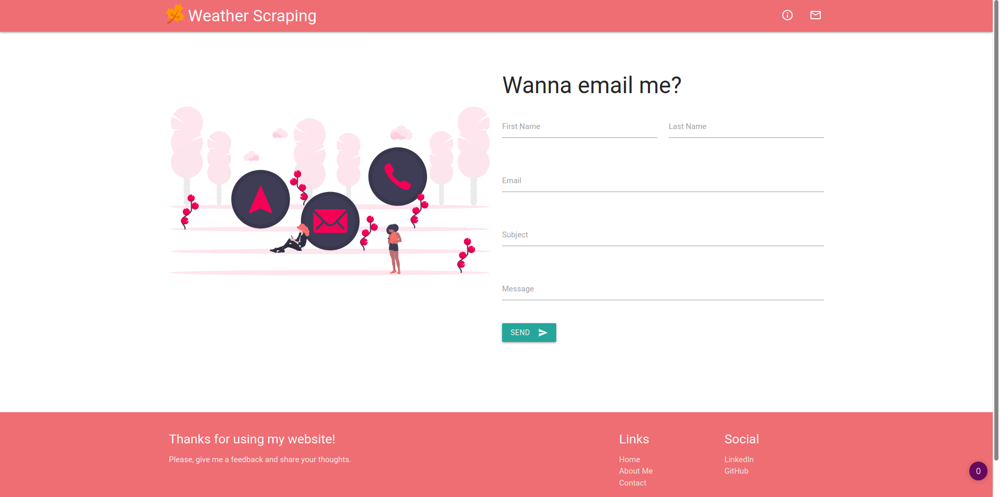

# Weather Scraping

<p style="text-align: center">
    
</p>

<p style="align-self: center">
    
</p>

<p style="align-self: center">
    
</p>

<p style="align-self: center">
    
</p>

<p style="align-self: center">
    
</p>

This project was made to learn how web scraping works. Basically, it takes data
from <a href="https://www.cptec.inpe.br/">Centro de Previsão de Tempo e Estudos Climáticos</a>, then filter out 
the meaningful information and display it in a beautiful way.

* **Materialize** and **BeautifulSoup4**.
* As fast as an eye's blink.

## How It Works

1. Get the input and check if it is valid.
2. Send a get request and grab the data from the source.
3. Filter the information with BeautifulSoup4.
4. The filtered data is sent to the frontend.
5. Use Materialize to display in a gorgeous way.


## How To Use

If you don't want to download and install the requirements, there is a online version 
<a href="https://weather-scrape.herokuapp.com/">here</a>.

<details><summary><b>Show instructions</b></summary>

1. Make sure you have installed all the requirements in the requirements.txt
2. Run:

    ```sh
    $ python manage.py runserver
    ```
3. Open the browser and enjoy.

</details>
